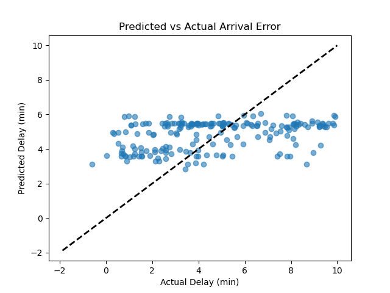

## Interpretation of the plot

- **X-axis**: Actual delay, ground truth
- **Y-axis**: Predicted delay from a linear model
- The dashed line is the identity line (perfect prediction)

### Positives

- As actual delay increases, predictions increase slightly
- Prediction variance is reasonably tight

### Negatives

- For `actual_delay > 6` predictions cluster near 5–6 min, not growing linearly
- For `actual_delay < 2` predictions cluster near 3-4 min, too high

This means we are biased towards the mean

## Model coefficients

```
0  hour             0.065893
1  dayofweek       -0.010351
2  is_weekend      -0.263213
3  direction_Linden 1.416742
```

- `direction_Linden = 1.41`: Linden-bound trains are consistently ~1.4 min more delayed than Howard-bound.
- `is_weekend = -0.26`: Weekend trains are more punctual. This might be due to the lack of data.
- `hour` and `dayofweek`: Effect is minimal, suggests that these have no effect.

## 